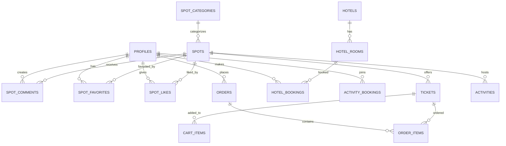

# 03. 数据库设计

本文档详细描述了旅游服务系统的数据库设计，包括表结构、关系和约束。

## 📊 数据库概览

- **数据库类型**: SQLite
- **表数量**: 15 张核心数据表
- **存储位置**: `data/travel.db`
- **字符集**: UTF-8

## 🗄️ 数据库 ER 图



## 📋 数据表详情

### 1. 用户表 (profiles)

存储用户基本信息和认证数据。

```sql
CREATE TABLE profiles (
    id INTEGER PRIMARY KEY AUTOINCREMENT,
    email TEXT UNIQUE NOT NULL,
    password_hash TEXT NOT NULL,
    full_name TEXT NOT NULL,
    role TEXT NOT NULL DEFAULT 'user', -- 'user', 'guide', 'admin'
    avatar_url TEXT,
    phone TEXT,
    bio TEXT,
    created_at DATETIME DEFAULT CURRENT_TIMESTAMP,
    updated_at DATETIME DEFAULT CURRENT_TIMESTAMP
);
```

**字段说明**：
- `id`: 用户唯一标识
- `email`: 邮箱，用于登录
- `password_hash`: 密码哈希值（bcrypt 加密）
- `role`: 用户角色
- `avatar_url`: 头像 URL
- `bio`: 个人简介

### 2. 景点分类表 (spot_categories)

景点分类管理。

```sql
CREATE TABLE spot_categories (
    id INTEGER PRIMARY KEY AUTOINCREMENT,
    name TEXT UNIQUE NOT NULL,
    description TEXT,
    icon TEXT,
    color TEXT DEFAULT '#3B82F6',
    sort_order INTEGER DEFAULT 0,
    created_at DATETIME DEFAULT CURRENT_TIMESTAMP
);
```

**示例数据**：
- 自然风光
- 历史古迹
- 主题公园
- 博物馆
- 宗教场所

### 3. 景点表 (spots)

存储景点详细信息。

```sql
CREATE TABLE spots (
    id INTEGER PRIMARY KEY AUTOINCREMENT,
    name TEXT NOT NULL,
    description TEXT,
    category_id INTEGER,
    location TEXT NOT NULL,
    latitude REAL,
    longitude REAL,
    price REAL DEFAULT 0,
    images TEXT, -- JSON 数组
    status INTEGER DEFAULT 1, -- 1: 正常, 0: 删除
    created_by INTEGER,
    created_at DATETIME DEFAULT CURRENT_TIMESTAMP,
    updated_at DATETIME DEFAULT CURRENT_TIMESTAMP,
    FOREIGN KEY (category_id) REFERENCES spot_categories(id),
    FOREIGN KEY (created_by) REFERENCES profiles(id)
);
```

### 4. 景点评论表 (spot_comments)

用户对景点的评论和评分。

```sql
CREATE TABLE spot_comments (
    id INTEGER PRIMARY KEY AUTOINCREMENT,
    spot_id INTEGER NOT NULL,
    user_id INTEGER NOT NULL,
    content TEXT NOT NULL,
    rating INTEGER NOT NULL CHECK(rating >= 1 AND rating <= 5),
    created_at DATETIME DEFAULT CURRENT_TIMESTAMP,
    FOREIGN KEY (spot_id) REFERENCES spots(id) ON DELETE CASCADE,
    FOREIGN KEY (user_id) REFERENCES profiles(id) ON DELETE CASCADE
);
```

### 5. 景点收藏表 (spot_favorites)

用户收藏的景点。

```sql
CREATE TABLE spot_favorites (
    id INTEGER PRIMARY KEY AUTOINCREMENT,
    spot_id INTEGER NOT NULL,
    user_id INTEGER NOT NULL,
    created_at DATETIME DEFAULT CURRENT_TIMESTAMP,
    UNIQUE(spot_id, user_id),
    FOREIGN KEY (spot_id) REFERENCES spots(id) ON DELETE CASCADE,
    FOREIGN KEY (user_id) REFERENCES profiles(id) ON DELETE CASCADE
);
```

### 6. 景点点赞表 (spot_likes)

用户点赞的景点。

```sql
CREATE TABLE spot_likes (
    id INTEGER PRIMARY KEY AUTOINCREMENT,
    spot_id INTEGER NOT NULL,
    user_id INTEGER NOT NULL,
    created_at DATETIME DEFAULT CURRENT_TIMESTAMP,
    UNIQUE(spot_id, user_id),
    FOREIGN KEY (spot_id) REFERENCES spots(id) ON DELETE CASCADE,
    FOREIGN KEY (user_id) REFERENCES profiles(id) ON DELETE CASCADE
);
```

### 7. 门票表 (tickets)

景点门票信息。

```sql
CREATE TABLE tickets (
    id INTEGER PRIMARY KEY AUTOINCREMENT,
    spot_id INTEGER NOT NULL,
    name TEXT NOT NULL,
    description TEXT,
    price REAL NOT NULL,
    original_price REAL,
    type TEXT DEFAULT 'adult', -- 'adult', 'child', 'student', 'senior'
    stock INTEGER DEFAULT 0,
    sales_count INTEGER DEFAULT 0,
    valid_days INTEGER DEFAULT 1, -- 有效天数
    status INTEGER DEFAULT 1,
    created_at DATETIME DEFAULT CURRENT_TIMESTAMP,
    FOREIGN KEY (spot_id) REFERENCES spots(id) ON DELETE CASCADE
);
```

### 8. 购物车表 (cart_items)

用户购物车。

```sql
CREATE TABLE cart_items (
    id INTEGER PRIMARY KEY AUTOINCREMENT,
    user_id INTEGER NOT NULL,
    ticket_id INTEGER NOT NULL,
    quantity INTEGER NOT NULL DEFAULT 1,
    created_at DATETIME DEFAULT CURRENT_TIMESTAMP,
    FOREIGN KEY (user_id) REFERENCES profiles(id) ON DELETE CASCADE,
    FOREIGN KEY (ticket_id) REFERENCES tickets(id) ON DELETE CASCADE
);
```

### 9. 订单表 (orders)

用户订单主表。

```sql
CREATE TABLE orders (
    id INTEGER PRIMARY KEY AUTOINCREMENT,
    user_id INTEGER NOT NULL,
    order_no TEXT UNIQUE NOT NULL,
    total_amount REAL NOT NULL,
    status TEXT DEFAULT 'pending', -- 'pending', 'paid', 'cancelled', 'refunded'
    payment_method TEXT,
    payment_id TEXT,
    contact_name TEXT,
    contact_phone TEXT,
    contact_email TEXT,
    notes TEXT,
    created_at DATETIME DEFAULT CURRENT_TIMESTAMP,
    updated_at DATETIME DEFAULT CURRENT_TIMESTAMP,
    FOREIGN KEY (user_id) REFERENCES profiles(id)
);
```

### 10. 订单详情表 (order_items)

订单中的门票详情。

```sql
CREATE TABLE order_items (
    id INTEGER PRIMARY KEY AUTOINCREMENT,
    order_id INTEGER NOT NULL,
    ticket_id INTEGER NOT NULL,
    quantity INTEGER NOT NULL,
    price REAL NOT NULL,
    subtotal REAL NOT NULL,
    created_at DATETIME DEFAULT CURRENT_TIMESTAMP,
    FOREIGN KEY (order_id) REFERENCES orders(id) ON DELETE CASCADE,
    FOREIGN KEY (ticket_id) REFERENCES tickets(id)
);
```

### 11. 酒店表 (hotels)

酒店信息。

```sql
CREATE TABLE hotels (
    id INTEGER PRIMARY KEY AUTOINCREMENT,
    name TEXT NOT NULL,
    description TEXT,
    location TEXT NOT NULL,
    address TEXT,
    latitude REAL,
    longitude REAL,
    star_rating INTEGER DEFAULT 3,
    facilities TEXT, -- JSON 数组
    images TEXT, -- JSON 数组
    status INTEGER DEFAULT 1,
    created_at DATETIME DEFAULT CURRENT_TIMESTAMP
);
```

### 12. 酒店房间表 (hotel_rooms)

酒店房间信息。

```sql
CREATE TABLE hotel_rooms (
    id INTEGER PRIMARY KEY AUTOINCREMENT,
    hotel_id INTEGER NOT NULL,
    name TEXT NOT NULL,
    type TEXT, -- 'single', 'double', 'suite', 'deluxe'
    price REAL NOT NULL,
    capacity INTEGER DEFAULT 2,
    area REAL, -- 面积（平方米）
    beds TEXT, -- 床型描述
    amenities TEXT, -- JSON 数组
    images TEXT, -- JSON 数组
    status INTEGER DEFAULT 1,
    created_at DATETIME DEFAULT CURRENT_TIMESTAMP,
    FOREIGN KEY (hotel_id) REFERENCES hotels(id) ON DELETE CASCADE
);
```

### 13. 酒店预订表 (hotel_bookings)

酒店预订记录。

```sql
CREATE TABLE hotel_bookings (
    id INTEGER PRIMARY KEY AUTOINCREMENT,
    user_id INTEGER NOT NULL,
    room_id INTEGER NOT NULL,
    check_in DATE NOT NULL,
    check_out DATE NOT NULL,
    nights INTEGER NOT NULL,
    price REAL NOT NULL,
    total_amount REAL NOT NULL,
    status TEXT DEFAULT 'pending', -- 'pending', 'confirmed', 'cancelled'
    guest_name TEXT,
    guest_phone TEXT,
    notes TEXT,
    created_at DATETIME DEFAULT CURRENT_TIMESTAMP,
    FOREIGN KEY (user_id) REFERENCES profiles(id),
    FOREIGN KEY (room_id) REFERENCES hotel_rooms(id)
);
```

### 14. 旅游活动表 (activities)

旅游活动信息。

```sql
CREATE TABLE activities (
    id INTEGER PRIMARY KEY AUTOINCREMENT,
    spot_id INTEGER,
    title TEXT NOT NULL,
    description TEXT,
    type TEXT, -- 'tour', 'workshop', 'performance', etc.
    start_date DATETIME NOT NULL,
    end_date DATETIME NOT NULL,
    max_participants INTEGER,
    current_participants INTEGER DEFAULT 0,
    price REAL DEFAULT 0,
    images TEXT, -- JSON 数组
    status INTEGER DEFAULT 1,
    created_by INTEGER,
    created_at DATETIME DEFAULT CURRENT_TIMESTAMP,
    FOREIGN KEY (spot_id) REFERENCES spots(id),
    FOREIGN KEY (created_by) REFERENCES profiles(id)
);
```

### 15. 新闻表 (news)

新闻公告。

```sql
CREATE TABLE news (
    id INTEGER PRIMARY KEY AUTOINCREMENT,
    title TEXT NOT NULL,
    content TEXT NOT NULL,
    summary TEXT,
    author_id INTEGER,
    images TEXT, -- JSON 数组
    view_count INTEGER DEFAULT 0,
    status INTEGER DEFAULT 1, -- 1: 已发布, 0: 草稿
    is_top INTEGER DEFAULT 0, -- 是否置顶
    created_at DATETIME DEFAULT CURRENT_TIMESTAMP,
    updated_at DATETIME DEFAULT CURRENT_TIMESTAMP,
    FOREIGN KEY (author_id) REFERENCES profiles(id)
);
```

## 🔐 索引设计

为了提高查询性能，数据库创建了以下索引：

```sql
-- 用户表索引
CREATE INDEX idx_profiles_email ON profiles(email);
CREATE INDEX idx_profiles_role ON profiles(role);

-- 景点表索引
CREATE INDEX idx_spots_category ON spots(category_id);
CREATE INDEX idx_spots_status ON spots(status);
CREATE INDEX idx_spots_location ON spots(location);

-- 评论表索引
CREATE INDEX idx_spot_comments_spot ON spot_comments(spot_id);
CREATE INDEX idx_spot_comments_user ON spot_comments(user_id);
CREATE INDEX idx_spot_comments_rating ON spot_comments(rating);

-- 收藏和点赞索引
CREATE INDEX idx_spot_favorites_spot ON spot_favorites(spot_id);
CREATE INDEX idx_spot_favorites_user ON spot_favorites(user_id);
CREATE INDEX idx_spot_likes_spot ON spot_likes(spot_id);
CREATE INDEX idx_spot_likes_user ON spot_likes(user_id);

-- 订单表索引
CREATE INDEX idx_orders_user ON orders(user_id);
CREATE INDEX idx_orders_status ON orders(status);
CREATE INDEX idx_orders_created ON orders(created_at);
```

## 📝 数据完整性约束

1. **外键约束**：确保数据引用完整性
2. **唯一约束**：防止重复数据
3. **检查约束**：确保数据值有效（如评分 1-5）
4. **非空约束**：关键字段必须有值

## 🚀 性能优化建议

1. **使用索引**：为常用查询字段创建索引
2. **分页查询**：大数据量时使用 LIMIT 和 OFFSET
3. **JSON 字段**：图片列表等使用 JSON 存储，减少表关联
4. **软删除**：使用 status 字段标记删除，保留数据

## 🔄 数据迁移

如需修改表结构：

1. 创建新的 SQL 文件 `scripts/005_alter_tables.sql`
2. 执行 SQL 语句修改表结构
3. 更新 TypeScript 类型定义
4. 重置数据库测试

## 📊 示例数据

系统初始化时会插入示例数据，包括：

- 1 个管理员账户
- 5 个景点分类
- 20 个景点
- 部分评论和评分数据
- 酒店和房间数据
- 新闻和活动数据

这些数据可用于开发和测试。