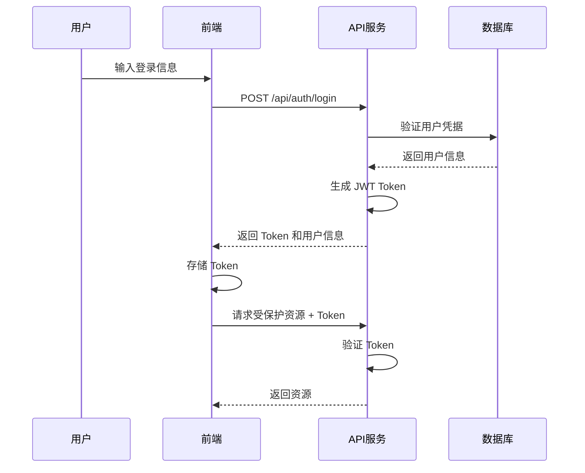

# 06. 认证系统

本文档详细说明了旅游服务系统的用户认证和权限管理机制。

## 🔐 认证机制概述

系统采用 JWT (JSON Web Token) 进行用户认证，实现了无状态的认证方案。

### 认证流程



## 📋 JWT Token 结构

### Token 载荷 (Payload)

```json
{
  "userId": 1,
  "email": "user@example.com",
  "role": "user",
  "iat": 1640995200,
  "exp": 1641600000
}
```

### Token 配置

- **算法**: HS256
- **过期时间**: 7 天
- **密钥来源**: 环境变量 `JWT_SECRET`

## 🗂️ 用户角色系统

### 角色定义

1. **user（普通用户）**
   - 浏览景点、酒店、活动
   - 评论、点赞、收藏
   - 购买门票、预订酒店
   - 查看个人订单

2. **guide（导游）**
   - 包含普通用户的所有权限
   - 创建和管理景点
   - 发布门票和活动
   - 查看游客信息

3. **admin（管理员）**
   - 包含所有权限
   - 管理所有数据
   - 用户管理
   - 系统配置

### 权限层级

```typescript
const roleHierarchy = {
  'admin': 3,
  'guide': 2,
  'user': 1
}
```

## 🛠️ 认证实现

### 1. 认证工具函数

```typescript
// lib/auth.ts

// 生成 JWT
export function generateToken(payload: any): string {
  return jwt.sign(payload, JWT_SECRET, { expiresIn: JWT_EXPIRES_IN })
}

// 验证 JWT
export function verifyToken(token: string): any {
  try {
    return jwt.verify(token, JWT_SECRET)
  } catch (error) {
    return null
  }
}

// 密码加密
export async function hashPassword(password: string): Promise<string> {
  return await bcrypt.hash(password, 10)
}

// 密码验证
export async function comparePassword(password: string, hash: string): Promise<boolean> {
  return await bcrypt.compare(password, hash)
}
```

### 2. 用户认证

```typescript
// 登录认证
export async function authenticateUser(email: string, password: string) {
  const user = dbGet(
    `SELECT id, email, password_hash, full_name, role FROM profiles WHERE email = ?`,
    [email]
  )

  if (!user || !user.password_hash) {
    return null
  }

  const isValidPassword = await comparePassword(password, user.password_hash)
  if (!isValidPassword) {
    return null
  }

  // 移除密码哈希
  delete user.password_hash

  // 生成 JWT
  const token = generateToken({
    userId: user.id,
    email: user.email,
    role: user.role
  })

  return { user, token }
}

// 用户注册
export async function registerUser(userData: RegisterUserData) {
  // 检查用户是否已存在
  const existingUser = dbGet('SELECT id FROM profiles WHERE email = ?', [userData.email])
  if (existingUser) {
    throw new Error('用户已存在')
  }

  // 加密密码
  const password_hash = await hashPassword(userData.password)

  // 创建用户
  const { lastInsertRowid } = dbRun(
    `INSERT INTO profiles (email, password_hash, full_name, role) VALUES (?, ?, ?, ?)`,
    [userData.email, password_hash, userData.full_name, userData.role || 'user']
  )

  // 返回用户信息和 Token
  const user = dbGet(
    `SELECT id, email, full_name, role FROM profiles WHERE id = ?`,
    [lastInsertRowid]
  )

  const token = generateToken({
    userId: user.id,
    email: user.email,
    role: user.role
  })

  return { user, token }
}
```

### 3. API 中间件

```typescript
// 验证请求中的 JWT
export function validateAuth(request: Request): { user: any; error?: string } {
  const authHeader = request.headers.get('authorization')
  if (!authHeader || !authHeader.startsWith('Bearer ')) {
    return { user: null, error: '未提供认证令牌' }
  }

  const token = authHeader.substring(7)
  const decoded = verifyToken(token)
  if (!decoded) {
    return { user: null, error: '无效的认证令牌' }
  }

  // 获取用户信息
  const user = dbGet(
    `SELECT id, email, full_name, role FROM profiles WHERE id = ?`,
    [decoded.userId]
  )

  if (!user) {
    return { user: null, error: '用户不存在' }
  }

  return { user }
}

// 角色权限检查
export function checkRole(userRole: string, requiredRole: string): boolean {
  const roleHierarchy = {
    'admin': 3,
    'guide': 2,
    'user': 1
  }

  return roleHierarchy[userRole as keyof typeof roleHierarchy] >=
         roleHierarchy[requiredRole as keyof typeof roleHierarchy]
}
```

## 🔐 API 路由保护

### 1. 认证检查

```typescript
// app/api/spots/route.ts
export async function POST(request: NextRequest) {
  const { user, error } = validateAuth(request)

  if (!user) {
    return NextResponse.json(
      { success: false, error: error || '请先登录' },
      { status: 401 }
    )
  }

  // 继续处理请求...
}
```

### 2. 权限检查

```typescript
// app/api/categories/route.ts
export async function POST(request: NextRequest) {
  const { user } = await validateAuth(request)

  // 检查权限（需要管理员权限）
  if (!checkRole(user.role, 'admin')) {
    return NextResponse.json(
      { success: false, error: '权限不足' },
      { status: 403 }
    )
  }

  // 继续处理请求...
}
```

### 3. 资源所有者检查

```typescript
// app/api/spots/[id]/route.ts
export async function PUT(request: NextRequest, { params }: { params: { id: string } }) {
  const { user } = await validateAuth(request)

  // 检查资源是否存在
  const spot = dbGet('SELECT * FROM spots WHERE id = ?', [params.id])
  if (!spot) {
    return NextResponse.json(
      { success: false, error: '资源不存在' },
      { status: 404 }
    )
  }

  // 检查权限（管理员或创建者）
  if (user.role !== 'admin' && spot.created_by !== user.id) {
    return NextResponse.json(
      { success: false, error: '权限不足' },
      { status: 403 }
    )
  }

  // 继续处理请求...
}
```

## 🔑 前端认证管理

### 1. Auth Context

```typescript
// contexts/auth-context.tsx
'use client'

interface AuthContextType {
  user: User | null
  token: string | null
  login: (email: string, password: string) => Promise<{ success: boolean; error?: string }>
  register: (data: RegisterData) => Promise<{ success: boolean; error?: string }>
  logout: () => void
  loading: boolean
}

export function AuthProvider({ children }: { children: ReactNode }) {
  const [user, setUser] = useState<User | null>(null)
  const [token, setToken] = useState<string | null>(null)

  useEffect(() => {
    // 从 localStorage 读取 token
    const storedToken = localStorage.getItem('token')
    if (storedToken) {
      setToken(storedToken)
      fetchCurrentUser(storedToken)
    }
  }, [])

  const login = async (email: string, password: string) => {
    const response = await fetch('/api/auth/login', {
      method: 'POST',
      headers: { 'Content-Type': 'application/json' },
      body: JSON.stringify({ email, password }),
    })

    const data = await response.json()
    if (data.success) {
      setUser(data.data.user)
      setToken(data.data.token)
      localStorage.setItem('token', data.data.token)
    }
    return { success: data.success, error: data.error }
  }

  const logout = () => {
    setUser(null)
    setToken(null)
    localStorage.removeItem('token')
  }

  return (
    <AuthContext.Provider value={{ user, token, login, logout, loading: false }}>
      {children}
    </AuthContext.Provider>
  )
}
```

### 2. API 客户端

```typescript
// lib/api-client.ts
export async function apiRequest(
  url: string,
  options: RequestInit = {}
): Promise<ApiResponse> {
  const token = localStorage.getItem('token')

  const defaultHeaders: HeadersInit = {
    'Content-Type': 'application/json',
  }

  if (token) {
    defaultHeaders.Authorization = `Bearer ${token}`
  }

  try {
    const response = await fetch(url, {
      ...options,
      headers: {
        ...defaultHeaders,
        ...options.headers,
      },
    })

    const data = await response.json()

    if (response.status === 401) {
      // Token 过期，清除并重定向到登录页
      localStorage.removeItem('token')
      window.location.href = '/auth/login'
    }

    return {
      success: response.ok,
      data: data.data,
      error: data.error,
    }
  } catch (error) {
    return {
      success: false,
      error: '网络错误',
    }
  }
}
```

## 🛡️ 安全措施

### 1. 密码安全

- 使用 bcrypt 进行密码哈希
- 盐值轮数设为 10
- 密码长度至少 6 位

### 2. JWT 安全

- 使用强密钥（至少 32 字符）
- 设置合理的过期时间（7 天）
- 验证 Token 签名

### 3. 输入验证

```typescript
// 使用 Zod 进行数据验证
const loginSchema = z.object({
  email: z.string().email('请输入有效的邮箱地址'),
  password: z.string().min(6, '密码至少需要 6 位'),
})
```

### 4. 防止常见攻击

- **SQL 注入**: 使用参数化查询
- **XSS**: 对用户输入进行转义
- **CSRF**: 使用 SameSite Cookie
- **暴力破解**: 限制登录尝试次数

## 🔄 Token 刷新机制

虽然当前 Token 有效期为 7 天，但可以扩展实现 Token 刷新：

```typescript
// 可选的刷新 Token 实现
export function generateRefreshToken(userId: number): string {
  return jwt.sign(
    { userId, type: 'refresh' },
    REFRESH_TOKEN_SECRET,
    { expiresIn: '30d' }
  )
}

// 使用刷新 Token 获取新的访问 Token
export async function refreshAccessToken(refreshToken: string) {
  try {
    const decoded = jwt.verify(refreshToken, REFRESH_TOKEN_SECRET)

    if (decoded.type !== 'refresh') {
      throw new Error('Invalid refresh token')
    }

    // 获取用户信息
    const user = dbGet('SELECT id, email, role FROM profiles WHERE id = ?', [decoded.userId])

    if (!user) {
      throw new Error('User not found')
    }

    // 生成新的访问 Token
    const newAccessToken = generateToken({
      userId: user.id,
      email: user.email,
      role: user.role
    })

    return { accessToken: newAccessToken }
  } catch (error) {
    throw new Error('Invalid refresh token')
  }
}
```

## 📝 最佳实践

### 1. 错误处理

- 不要暴露敏感信息
- 使用通用的错误消息
- 记录详细的错误日志

### 2. Token 存储

- 使用 localStorage（考虑 XSS 风险）
- 考虑使用 httpOnly Cookie
- 实现自动登出机制

### 3. 会话管理

- 实现"记住我"功能
- 处理多设备登录
- 提供强制登出其他设备功能

### 4. 权限管理

- 遵循最小权限原则
- 定期审查权限设置
- 实现权限继承机制

## 🚨 常见问题

### Q: Token 存在哪里？

A: 当前实现存储在 localStorage。生产环境建议使用 httpOnly Cookie。

### Q: 如何实现"记住我"？

A: 可以生成有效期更长的 Token 或使用刷新 Token 机制。

### Q: 如何处理并发登录？

A: 可以在用户表中添加 last_login 字段，或实现设备管理功能。

### Q: 如何提高安全性？

A:
- 使用 HTTPS
- 实现 IP 白名单
- 添加二次验证
- 监控异常登录行为

---

本认证系统提供了完整的安全解决方案，如需扩展功能，请参考最佳实践部分。